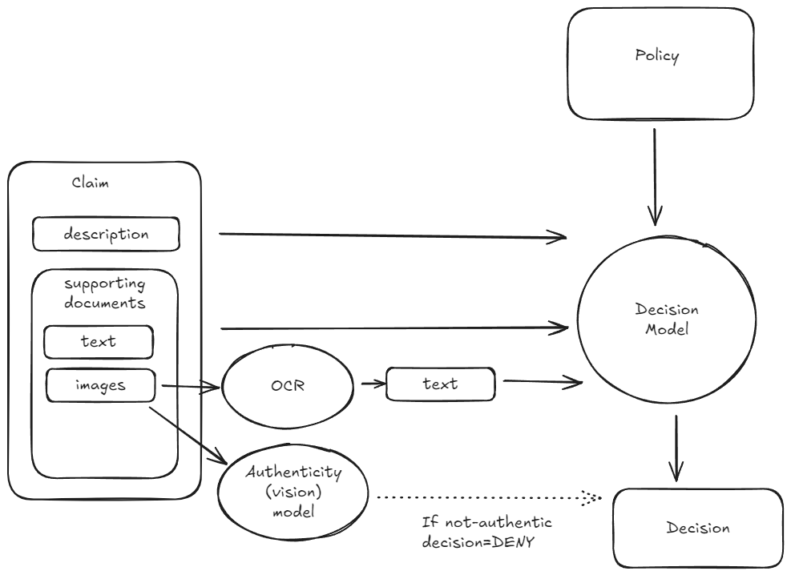

# Insurance Claim Processing Pipeline

**Note: an explanation about my approach and future directions can be found in `approach.md`**

An intelligent insurance claim processing system that analyzes claims with supporting documents and makes automated coverage decisions using Large Language Models (LLMs) and vision models.

## Overview

This system processes insurance claims by:
- Analyzing claim descriptions and supporting documents
- Performing document authenticity checks
- Extracting text from images using OCR
- Making coverage decisions (APPROVE/DENY/UNCERTAIN) based on policy rules
- Providing detailed reasoning for each decision

## Features

- **Multi-format Document Processing**: Handles both text documents and images (PNG, JPG, WEBP)
- **OCR Capability**: Extracts text from document images using vision models
- **Authenticity Verification**: Detects potentially fraudulent or manipulated documents
- **LLM-based Decision Making**: Uses advanced language models to analyze claims against policy rules
- **RESTful API**: FastAPI-based endpoints for claim submission and retrieval
- **Batch Processing**: Process multiple claims and evaluate against ground truth
- **Multilingual Support**: Handles documents in multiple languages (English, Spanish, French, Italian, German)

## Installation

### Prerequisites

- Python 3.11+
- [uv](https://github.com/astral-sh/uv) package manager (recommended) or pip

### Setup

1. Clone the repository:
```bash
git clone <repository-url>
cd insurance_processing
```

2. Install dependencies:
```bash
uv sync
# or
pip install -e .
```

3. Set up environment variables:
Create a `.env` file in the root directory:
```env
OPENROUTER_API_KEY=your_openrouter_api_key_here
```

4. Verify installation:
```bash
fastapi dev api.py
```

5. Testing the API
```bash
uv run test_api.py
```

## API Documentation

The API is built with FastAPI and provides the following endpoints:

### Health Check

**GET** `/health`

Check if the API is running.

**Response:**
```json
{
  "message": "OK"
}
```

### Submit a Claim

**POST** `/claims`

Submit a new insurance claim for processing. The claim is processed asynchronously in the background.

**Request Body:**
```json
{
  "claim_id": 1,
  "description_text": "Customer's description of the incident...",
  "supporting_documents": [
    {
      "file_name": "medical_certificate.png",
      "document_bytes": "<base64_encoded_file_content>"
    }
  ]
}
```

**Response:**
```json
{
  "status": 200,
  "message": "Successfully submitted claim, claim decision should be available soon"
}
```

**Note:** The claim is processed asynchronously. Use the GET endpoint to retrieve the decision once processing is complete.

### Process a Claim (Synchronous)

**POST** `/process_claim`

Process a claim synchronously and return the decision immediately.

**Request Body:**
```json
{
  "claim_id": 1
}
```

**Response:**
```json
{
  "reasoning": "Detailed explanation of the decision...",
  "decision": "APPROVE"
}
```

**Possible Decision Values:**
- `APPROVE`: Claim is valid and covered by the policy
- `DENY`: Claim is not covered or invalid
- `UNCERTAIN`: Edge case requiring human review

### Get Claim Decision

**GET** `/claims/{claim_id}`

Retrieve the decision for a processed claim.

**Response:**
```json
{
  "reasoning": "The claim meets all policy requirements...",
  "decision": "APPROVE"
}
```

### List All Claims

**GET** `/claims`

Get a list of all processed claim IDs.

**Response:**
```json
[1, 2, 3, 4, 5]
```

## Processing Logic

The claim processing pipeline follows a multi-stage workflow:



### Stage 1: Claim Submission
When a claim is submitted via the API:
1. Claim data is stored in the `assignment/claim {id}/` directory
2. Description text is saved to `description.txt`
3. Supporting documents are saved with their original filenames

### Stage 2: Document Authenticity Check (Optional)
If enabled (`CHECK_AUTHENTICITY=True`):
1. Image documents are analyzed using a vision model (GPT-5 Image mini)
2. The model checks for signs of manipulation, editing, or fraud
3. Documents receive an authenticity score (0-5)
4. If score < threshold (default: 2), the claim is automatically **DENIED**

### Stage 3: Document Processing
1. **Text Documents**: Content is directly extracted and formatted
2. **Image Documents**: 
   - If OCR is enabled (`USE_OCR=True`): Text is extracted using a vision model (Qwen2.5-VL)
   - If OCR is disabled: Placeholder text is used

### Stage 4: Policy Analysis
1. The insurance policy is loaded from `assignment/policy.md`
2. Claim description and processed documents are combined
3. The decision engine analyzes the claim against policy rules

### Stage 5: Decision Making
The `SimpleLLMDecisionEngine` uses an LLM (Gemini 2.5 Pro) to:
1. Review the claim description
2. Analyze all supporting documents
3. Compare against policy coverage rules
4. Generate a decision (APPROVE/DENY/UNCERTAIN) with reasoning

### Stage 6: Result Storage
The decision is saved to `results/{config_name}/claim {id} decision.json`

## Configuration

Key configuration options in `src/claim_processing/constants.py`:


## Running the Application

### Start the API Server

```bash
uv run fastapi dev api.py
# or
task startup
```

The API will be available at `http://localhost:8000`

API documentation (Swagger UI) is available at `http://localhost:8000/docs`

### Process All Claims

To process all claims in the assignment directory and evaluate results:

```bash
uv run python -m claim_processing.evaluate
```

This will:
1. Process all 25 claims in the benchmark dataset
2. Compare decisions against expected answers
3. Generate accuracy metrics
4. Save results to `results/{config_name}/`

Results include:
- **Accuracy**: Percentage of correct decisions
- **Per-claim comparisons**: Expected vs. predicted decisions
- **CSV export**: Detailed results in `results.csv`

Note: the configuration to use for evaluation can be changed manually in `claim_processing/evaluate.py`.

## Project Structure

```
insurance_processing/
├── api.py                          # FastAPI application entry point
├── src/
│   └── claim_processing/
│       ├── __init__.py
│       ├── constants.py            # Configuration constants
│       ├── evaluate.py             # Evaluation script
│       ├── process.py              # Core processing logic
│       ├── prompts.py              # LLM prompts
│       ├── pydantic_models.py     # Data models
│       └── utils/
│           ├── decision_engines.py # Decision engine implementations
│           ├── image_utils.py      # Image processing utilities
│           ├── load.py             # Data loading utilities
│           └── openai_utils.py     # OpenAI API utilities
├── assignment/                     # Benchmark dataset
│   ├── policy.md                  # Insurance policy document
│   ├── claim 1/                   # Individual claim directories
│   │   ├── description.txt
│   │   ├── answer.json            # Expected decision
│   │   └── supporting documents
│   └── ...
├── results/                        # Processing results
│   ├── SimpleLLM/                 # Results by configuration
│   ├── SimpleLLMAuth/
│   └── ...
├── diagrams/
│   └── full_diagram.png           # Processing flow diagram
└── pyproject.toml                 # Project dependencies
```

## Decision Engines

The system supports multiple decision engines:

### SimpleLLMDecisionEngine
- Uses Gemini 2.5 Flash for claim analysis
- Analyzes claim description, documents, and policy
- Returns structured decisions with reasoning

### DummyDecisionEngine
- Simple test engine that returns a fixed decision
- Useful for testing and development

## Example Usage

### Python Client Example

```python
import requests
import base64

# Submit a claim
with open("medical_certificate.png", "rb") as f:
    image_bytes = base64.b64encode(f.read()).decode('utf-8')

claim_data = {
    "claim_id": 26,
    "description_text": "I was hospitalized during my trip to Spain...",
    "supporting_documents": [
        {
            "file_name": "medical_certificate.png",
            "document_bytes": image_bytes
        }
    ]
}

response = requests.post("http://localhost:8000/claims", json=claim_data)
print(response.json())

# Retrieve decision (after processing completes)
decision = requests.get(f"http://localhost:8000/claims/26")
print(decision.json())
```

### cURL Example

```bash
# Submit a claim
curl -X POST "http://localhost:8000/claims" \
  -H "Content-Type: application/json" \
  -d '{
    "claim_id": 26,
    "description_text": "I was hospitalized during my trip...",
    "supporting_documents": []
  }'

# Get decision
curl "http://localhost:8000/claims/26"
```

## Development

### Code Quality

Run linting and formatting:

```bash
task clean
```

This runs:
- `isort`: Import sorting
- `ruff check`: Linting
- `ruff format`: Code formatting

### Adding New Decision Engines

Create a new class inheriting from `DecisionEngine`:

```python
from claim_processing.utils.decision_engines import DecisionEngine
from claim_processing.pydantic_models import Claim, ClaimDecision

class MyCustomEngine(DecisionEngine):
    def decide_claim(self, claim: Claim) -> ClaimDecision:
        # Your logic here
        return ClaimDecision(decision="APPROVE", reasoning="...")
```

## Benchmark Dataset

The repository includes a benchmark dataset with 25 insurance claims:

- **9 APPROVE claims** (31%)
- **15 DENY claims** (52%)
- **5 UNCERTAIN claim** (17%)

Claim types include:
- Medical emergencies and hospitalizations
- Travel disruptions (flights, trains)
- Legal obligations (jury duty, court appearances)
- Theft and loss incidents
- Accidents

See `assignment/README.md` for detailed dataset information.

## Dependencies

- **FastAPI**: Web framework for the API
- **OpenAI**: Client for LLM and vision model APIs
- **Pydantic**: Data validation and models
- **MLflow**: Experiment tracking (optional)
- **Pandas**: Data analysis for evaluation
