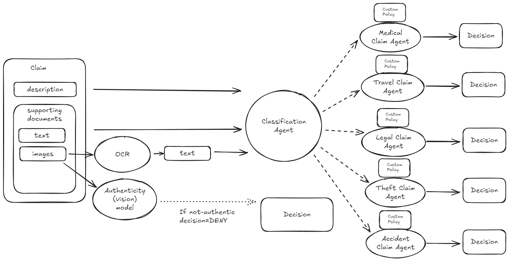

# Approach
## Way of working
### Step 1: understanding the task and data
This project was started with a clear goal in mind: creating a generic insurance processing API. Next to e.g. understanding possible input data and considering output formats, this also included understanding the insurance processing problem: if I were to do this task manually, based on what characteristics should I judge the claims? 

The final solution should consist of an API with multiple endpoints, that is able to accept insurance claims (consisting of one or more supporting documents), process these, and store the final outcome (APPROVE/DENY/UNCERTAIN) including a reasoning. Available insurance claim outcomes can then be retrieved and inspected.

### Step 2: A minimum viable solution
After understanding the task, I started with creating a minimal framework based on the requirements described above. I began with creating the FastAPI endpoints, and based on these, I created the functionalities required for uploading, processing and listing claims.

Most of the more complex functionalities were still mocked in this stage, e.g. instead of an actual LLM, a dummy decision engine was used that always returned 'DENY' for every claim. Moreover, only plain text documents could be processed at this stage.

### Step 3: Setting up evaluation
You can not optimize what you can not measure, and therefore I quickly focused on setting up an evaluation script. The metric was simple: accuracy, giving an indication of how many predicted decisions were correct. Based on a dataset with example documents and their expected claim outputs, the dummy implementation already provided a baseline score of 51% (as the dataset consisted of 51% claims that had a 'reject' outcome.

### Step 4: Additional components
Based on my findings of step 1, I had several ideas to improve the solution, out of which I focused on a few due to time constraints. The improvements included (in this order):
- Changing the dummy decision model to an LLM with a simple prompt (accuracy: 36%)
- Adding an image-document-authenticity check using a vision model (accuracy: 28%, model was too strict)
- Adding OCR for image-documents (accuracy: 32%)
- Switching from Gemini 2.5 Flash to Gemini 2.5 Pro (accuracy: 48%)
- Optimizing the decision making prompt by more carefully inspecting mistakes and data (accuracy: 72%!)

With still enough ideas to further optimize the solution, the current implementation settled on an accuracy of 72%, of which the results can be found in the directory `results/SimpleLLMAuthOCRProImproved`.

## General principles
My approach for this assignment was based on two main principles which I further want to highlight:

- Divide and conquer

Divide complex tasks into smaller, simpler tasks that can be optimized individually. This has two benefits: 1) it gives explainability, as it allows you to check for each decision, which individual steps led to that decision (e.g. did the document pass the authenticity check?) 2) with a smaller scope, models will generally have more focus and align better to guidelines.

- Evaluation is key

You can not optimize without evaluating. By focussing on evaluation from the start, you skip the 'eye-balling' stage (which does not scale), and instead have quantifiable metrics from the start that allow you to test your changes. Preferably, you should also not only evaluate final outputs, but also evaluate and optimize individual components. For example, acquire ground-truth data to evaluate the document-authenticity check and optimize it individually. Using MLFlow, we can then track different versions (e.g. different prompts, models or parameters) and chose the best.

## Future improvements
### Approach improvements
Although the current accuracy (72%) is already a good improvement compared to the baseline, there are still many things to improve. In future improvements, I would focus on the following:

- Dividing the decision step into smaller components

Instead of using one LLM agent to decide the approval of all the claims, it would be beneficial to create specialized claim agents for the different claim types. For example, a claim about a medical accident has different requirements than a claim about delays. By creating specialized agents for the different claim types, and adding a classification step to route claims to the right agents, you create more focussed agents and can optimize for different claim types.

An example implementation of this can be found in the diagram below:

- Acquiring more fine-grained validation data

In line with the 'Evaluation is key' principle highlighted above, preferably you want to optimize each component individually. This would require e.g. acquiring data to optimize the document-authenticity check, the OCR step, or the claim-classification step.

- Automatic feedback and optimization

By adding a feedback agent that compares our predicted decisions with the actual answers, we can create an automatic feedback and optimization loop that can give us suggestions on things to improve to our pipeline. For example, it can give us hints for the type of cases that often go wrong, or give suggestions on how to change the prompt such that our pipeline would perform better.

### Infrastructure improvements

- Dockerizing the application components
  
To allow reproducability and deployment of this solution in Cloud environments, I would recommend to dockerize the components, such as the API and the claim processing pipeline. Moreover, to sustain the claim data and decisions, a database can be set up which can be used to read/write data.
- Frontend for uploading claims and inspecting decisions

To make it easier for customers to upload claims and inspect claim decisions, it would be beneficial to have a user-interface instead of interacting with the API directly. This UI could consist of various tabs, e.g. a tab with an upload window where users can create claims and add supporting documents, and a tab where users can inspect their claims and the claim decisions.
